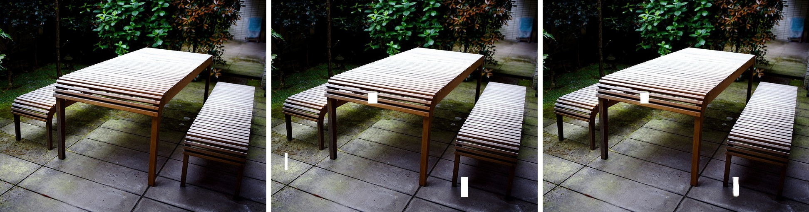
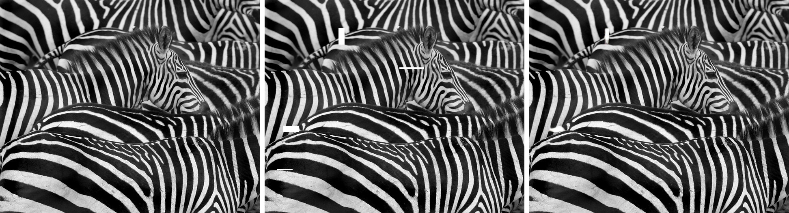
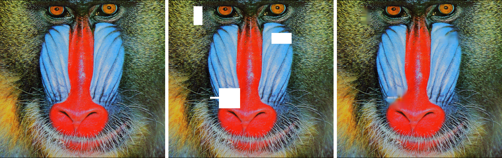
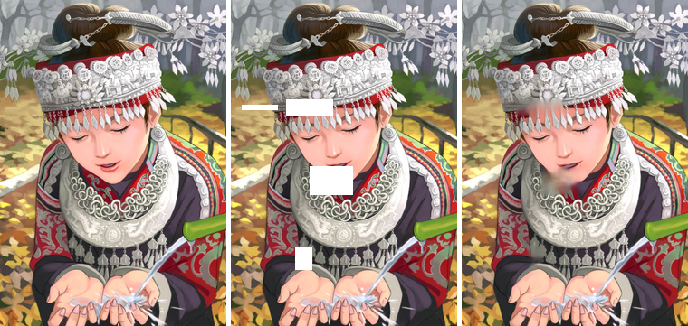

# Image Inpainting
## What is Image Inpainting
Image inpainting is a restorative process that allows for the fixing or removal of unwanted parts within images. Typically, this process is done by professionals who use software to change the image to remove the imperfection painstakingly. A deep learning approach bypasses manual labor typically used in this process and applies a neural network to determine the proper fill for the parts of the image.

## Examples

##### *From left to right: original, interpolated (Nearest Neighbor upscaling), and prediction (from neural network)* 
To see a higher quality version, **[click](https://github.com/JoshVEvans/Super-Resolution/tree/master/evaluation/Combined) on the images**. In some cases, the upscaled image looks even better than the original!

## Reasearch and Development
The model architecture is created using a fully convolutional deep residual network. I had pretty good intuition that this type of model would work, as it had on my previous projects for image restoration. I looked into other architectures such as UNET for inpainting but ran into troubles while implementing them.

First, [`UNET`](https://en.wikipedia.org/wiki/U-Net) requires you to splice images during inference, meaning that the image splice had to be larger than the white space that the user is trying to inpaint. For example, if the splices you set up for inference were set up to take 64x64 chunks of the image and you managed to get whitespace that fully engulfed this splice, feeding this into the model would result in improper pixels due to the model not having any reference. This would require a different architecture that would detect the size of the white space for images so that you could adequately select the image splice size.

The following architecture I looked into and tried implementing was a  [`GAN (Generative Adversarial Network)`](https://en.wikipedia.org/wiki/Generative_adversarial_network) based model. I've experimented with GANs and implemented a model that could generate faces using images from the CelebA dataset; however, using GANs for Inpainting proved a much more complex problem. There are issues that I faced with proper ratios of the loss functions being L1 loss and the adversarial loss of the discriminator. Although a GAN-based model would likely drastically improve the output during inference, I could not tune the hyper-parameters enough to balance both the loss functions and the training of the generator and discriminator.

### Model Architecture

| Methods       | Depth |      Filters      | Parameters | Training Time |
| ------------- | :---: | :---------------: | :--------: | :-----------: |
| Inpaint Model |  50   | (49 layers) 192-3 |  15,945k   |    ~30hrs     |

## Network Architecture:

## How do you use this model?
Due to the sheer size of this model, I can't fully upload it onto GitHub. Instead, I have opted to upload it via Google Drive, where you should be able to download it. Place this download '*.h5*' file and place it inside the '**weights/**' directory. 

## How can you train your own model?
The model is instantiated within [`network.py`](https://github.com/JoshVEvans/Image-Inpainting/blob/main/network.py). You can play around with hyper-parameters there. First, to train the model, delete the images currently within `data/` put your training image data within that file - any large dataset such as [`ImageNet`](https://www.image-net.org/) or an equivalent should work. Finally, mess with hyper-parameters in [`train.py`](https://github.com/JoshVEvans/Image-Inpainting/blob/master/train.py) and run `train.py`. If you’re training on weaker hardware, I’d recommend lowering the `batch_size` below the currently set ***4*** images.

## Qualitative Examples (click on the images for higher quality):
#### Set 5 Evaluation Set:
Images Left to Right: Original, Interpolated, Predicted

### Hardware - Training Statistics
##### Trained on 3070 ti
###### Batch Size: 4
###### Training Image Size: 96x96

### Author
##### Joshua Evans - [github/JoshVEvans](https://github.com/JoshVEvans)
